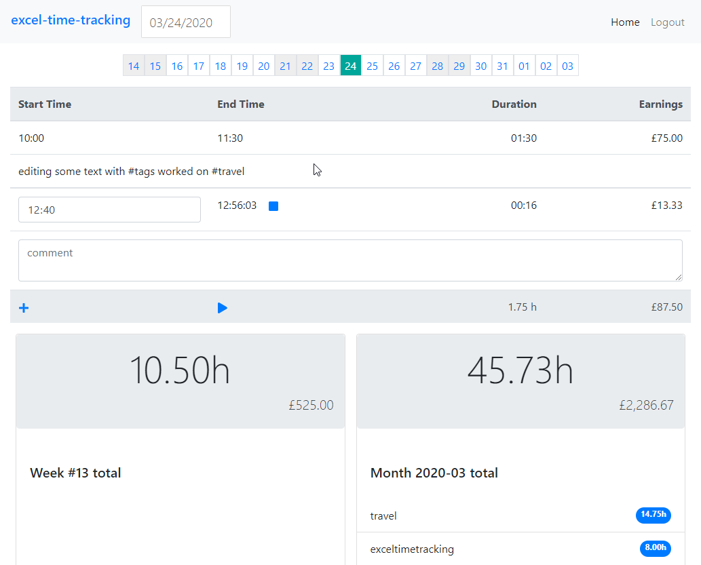

# Excel Time Tracking with React
## because Excel is boooring

Time tracking as easy as in Excel.

1. Select a date with a date picker or <kbd>Ctrl+Shift+Left</kbd>, <kbd>Ctrl+Shift+Right</kbd>.
1. Click [+] or press <kbd>Insert</kbd>
1. Enter starting time, enter end time or leave the timer running.
1. Enter a comment which may include hash tags.
1. Press <kbd>Ctrl+Enter</kbd> to save.
1. Edit any previous time record as in Excel (just click the time).
1. See daily, weekly and monthly totals including total time spent by hash tags.
1. Calculate your earnings (daily, weekly, monthly).
1. The data is stored in localStorage - it never leaves your device.

### Todo

- [ ] Edit the rate/hour. Currently, hardcoded to $50.
- [ ] Connect to firebase and implement login.
- [ ] Export data to JSON for backup and transfer to other apps.
- [ ] Allow selecting the currency. Currently, auto-detected based on the language of the browser.
